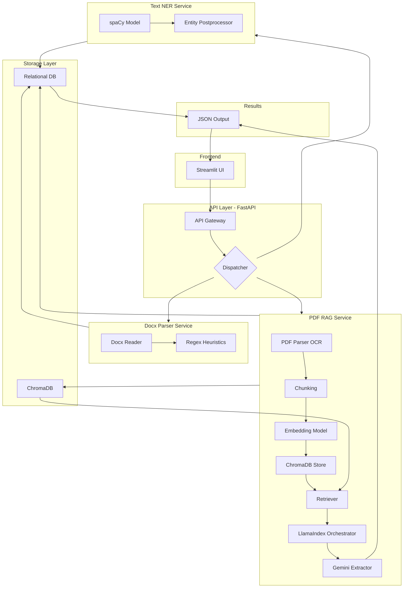

# Global Architecture Document (GAD)

**Project:** Financial Document Reader — NER Proof of Concept (PoC)

**Author:** Shashank Agasimani

**Date:** 2025-09-23

---

## 1. Purpose & Scope

This GAD describes a high-level architecture for a financial document reader that extracts structured entities from financial documents (DOCX, chat/plain text, PDF). The system is built as a PoC focused on **Named Entity Recognition (NER)** and demonstrates three processing flows:

* Rule-based parsing for DOCX
* HuggingFace Transformers-based NER for chat/text
* LLM + RAG pipeline (Google Gemini + ChromaDB + HuggingFace embeddings + LlamaIndex) for PDFs

The document includes component interactions, data flow, example APIs, storage choices, security considerations, and an example output schema.

---

## 2. High-level architecture



> Diagram (Mermaid) visualizes how the Streamlit UI calls FastAPI. The API dispatches to specialized services and returns a JSON result to the UI.

---

## 3. Components & Responsibilities

### 3.1 Streamlit (Frontend)

* Purpose: simple web UI for uploading documents, pasting text, selecting processing mode (NER, Summary, Q\&A), and displaying results.
* Actions: POST file/text to FastAPI endpoints, poll for async job status (for large PDFs).

### 3.2 FastAPI (API Layer)

* Exposes endpoints for: `/upload`, `/ner`, `/status/{job_id}`, `/health`.
* Validates input and orchestration: routes requests to the appropriate pipeline (docx/text/pdf).
* For heavy/long-running jobs (PDF → LLM) it enqueues tasks and returns job id.

### 3.3 Docx Parser Service (Rule-based)

* Libraries: `python-docx`, regex, dateparser.
* Responsibility: reliably parse semi-structured term sheets and extract target entities using deterministic rules and heuristics.
* Output: JSON with entities + metadata (confidence = deterministic / high).

### 3.4 Text NER Service (HuggingFace Transformers)

* Libraries: HuggingFace Transformers (dslim/bert-base-NER), custom entity labels possible with fine-tuning.
* Responsibility: run NER on chat-like or free text and return token-level and span-level extractions.
* Fine-tuning: methodology doc (GMD) describes how to fine-tune on labeled financial data.

### 3.5 PDF RAG Service (LLM + Vector DB)

* Libraries: LlamaIndex (framework), ChromaDB (vector store), embedding model `baai/bge-base-en-v1.5`, Google Gemini for generative extraction and reasoning.
* Responsibility: preprocess PDF (OCR if required), chunk text, create embeddings, store/retrieve vectors, and use RAG to ask the LLM targeted prompts for structured extraction.
* Output: JSON with extracted entities, provenance (source chunk ids), confidence/LLM reasoning trace.

### 3.6 Storage

* **ChromaDB**: persistent vector store for embeddings (PDF chunks + metadata).
* **Relational DB** (optional): persisted structured entity records for each processed document (Postgres/SQLite for PoC).
* **Object store / filesystem**: encrypted temporary storage for uploaded files.

---

## 4. Data Flow & Processing

### 4.1 Docx flow (sync)

1. Streamlit upload → `POST /ner` (type=docx)
2. FastAPI validates → calls Docx Parser Service
3. Parser reads docx, runs heuristics (header matching, key-value patterns, table parsing)
4. Parser returns JSON (entities + confidence)
5. FastAPI stores result in DB and returns JSON to UI

### 4.2 Chat/text flow (sync)

1. Streamlit paste/text → `POST /ner` (type=text)
2. FastAPI forwards to spaCy NER service
3. spaCy returns spans & labels → post-process to canonicalize dates/currencies
4. Store results and return JSON

### 4.3 PDF flow (async / RAG)

1. Streamlit upload → `POST /ner` (type=pdf)
2. FastAPI stores file, enqueues job (BackgroundWorker/Celery/Rq)
3. Worker: (a) OCR (if needed), (b) split into chunks, (c) compute embeddings (baai/bge), (d) upsert into ChromaDB
4. Run retrieval for candidate chunks and prompt Gemini via LlamaIndex to extract entities.
5. Return structured JSON and provenance for each entity; store in DB.

---

## 5. API Design (Example)

### `POST /ner` (sync)

Request body (multipart/form-data):

* `file` (optional) - uploaded file
* `text` (optional) - raw text
* `mode` - one of `docx` | `text` | `pdf`
* `entities` (optional) - list of desired entity names to extract

Response (200):

```json
{
  "job_id": null,
  "status": "done",
  "entities": { ... },
  "provenance": { ... }
}
```

### `POST /ner?async=true` (for PDF)

Response (202 Accepted):

```json
{ "job_id": "uuid-1234", "status": "queued" }
```

### `GET /status/{job_id}`

Returns job state and result when completed.

---

## 6. Entity Schema / Example Output

Canonical entity names and types (PoC):

* `Counterparty` (string)
* `Notional` (currency + numeric)
* `ISIN` (string)
* `Underlying` (string)
* `InitialValuationDate` (YYYY-MM-DD)
* `ValuationDate` (YYYY-MM-DD)
* `EffectiveDate` (YYYY-MM-DD)
* `TerminationDate` (YYYY-MM-DD)
* `Coupon` (percentage)
* `Barrier` (percentage)
* `Exchange` (string)
* `CalculationAgent` (string)
* `InterestPayments` (text/enum)

Example JSON (from Allianz trade):

```json
{
  "Counterparty": "BANK ABC",
  "PartyB": "CACIB",
  "TradeDate": "2025-01-31",
  "TradeTime": "09:12:15",
  "InitialValuationDate": "2025-01-31",
  "EffectiveDate": "2025-02-07",
  "Notional": "EUR 1,000,000",
  "UpfrontPayment": "TBD",
  "ValuationDate": "2026-07-31",
  "TerminationDate": "2026-08-07",
  "Underlying": "Allianz SE (ISIN DE0008404005)",
  "Exchange": "XETRA",
  "Coupon": "0%",
  "Barrier": "75%",
  "InterestPayments": "None",
  "CalculationAgent": "Party B and Party A",
  "ISDADocumentation": "Option"
}
```

---

## 7. Tech Stack & Libraries (PoC)

* Frontend: **Streamlit**
* API: **FastAPI** (uvicorn)
* Docx parsing: `python-docx`, `regex`, `dateparser`
* NER: **HuggingFace Transformers** (dslim/bert-base-NER, optionally fine-tuned)
* LLM & RAG: **Google Gemini** (LLM), **LlamaIndex** (framework), **ChromaDB** (vector DB), embeddings: `baai/bge-base-en-v1.5`
* Storage: SQLite/Postgres (PoC), filesystem for temp files
* Background jobs: Celery / RQ / FastAPI BackgroundTasks

---

## 8. Implementation Notes, Methodology, and Scope Clarification

### 8.1 Scope Clarification
This Proof of Concept (PoC) **only implements Named Entity Recognition (NER)** for financial documents, as per the coding test objectives. Features such as document classification, summarization, topic modeling, and Q&A are out of scope for this submission, but the architecture is designed to be extensible for those in the future.

### 8.2 What is Implemented
- **NER for DOCX:** Rule-based parser using `python-docx`, regex, and heuristics.
- **NER for Chat/Text:** General-purpose NER using HuggingFace Transformers (`dslim/bert-base-NER`).
- **NER for PDF:** LLM + RAG pipeline using LlamaIndex, Gemini, and ChromaDB.
- **Streamlit UI:** For uploading DOCX, PDF, TXT and extracting/displaying entities.
- **API:** FastAPI endpoints for health, extraction, and PDF ingestion/query.
- **ChromaDB:** Used for vector storage in the RAG pipeline.

### 8.3 What is Not Implemented (and Why)
- **Classification, Summarization, Topic Modeling, Q&A:** Not required for this NER PoC.
- **Async job handling for PDFs:** All processing is synchronous; no `/status/{job_id}` endpoint.
- **Unified `/upload` and `/ner` endpoints:** Endpoints are split by type for clarity and modularity.
- **Relational DB for entity storage:** Not implemented; ChromaDB and filesystem are used.
- **OCR for PDFs:** Not explicitly implemented; assumes PDFs are text-based.
- **spaCy/fine-tuned NER:** Uses HuggingFace Transformers for NER due to ease of use and accuracy; spaCy or fine-tuning can be added in future work.
- **Strict entity schema enforcement:** Output schema is flexible and depends on the extraction model.

### 8.4 NER Fine-Tuning Methodology (GMD)
If further accuracy or domain adaptation is required, the following methodology can be used to fine-tune a NER model for financial entities:

1. **Data Collection:**
   - Gather a corpus of financial documents (term sheets, contracts, chat logs, etc.).
   - Annotate entities of interest (e.g., Counterparty, Notional, ISIN, Dates, Coupon, Barrier, etc.) using annotation tools like Prodigy, doccano, or Label Studio.

2. **Data Preparation:**
   - Convert annotated data to a format compatible with the chosen NER framework (e.g., spaCy, HuggingFace). For HuggingFace, use the CoNLL or JSON format.

3. **Model Selection:**
   - Start with a pretrained model (e.g., `bert-base-cased`, `dslim/bert-base-NER`, or a spaCy transformer model).

4. **Fine-Tuning:**
   - Train the model on the annotated dataset, monitoring entity-level F1 score.
   - Use early stopping and validation splits to avoid overfitting.

5. **Evaluation:**
   - Evaluate on a held-out test set. Report precision, recall, and F1 for each entity type.

6. **Deployment:**
   - Integrate the fine-tuned model into the backend pipeline (replace the general NER model).
   - Optionally, expose a `/ner` endpoint for custom entity extraction.

7. **Continuous Improvement:**
   - Periodically retrain with new annotated data to improve coverage and accuracy.

### 8.5 LLM/RAG Pipeline Methodology (for PDF NER)
- **Chunking:** PDF is split into manageable text chunks.
- **Embedding:** Each chunk is embedded using a transformer model (HuggingFace).
- **Vector Storage:** Embeddings are stored in ChromaDB.
- **Retrieval:** At query time, relevant chunks are retrieved based on similarity to the user query.
- **LLM Extraction:** Gemini LLM is prompted with the retrieved context to extract entities.
- **Extensibility:** This pipeline can be adapted for Q&A, summarization, or topic modeling by changing the prompt and post-processing logic.

---

## 9. How to Run and Test
- Install requirements: `pip install -r requirements.txt`
- Start the FastAPI backend: `uvicorn app.api.main:app --reload`
- Start the Streamlit frontend: `streamlit run app/frontend/streamlit_app.py`
- Upload DOCX, PDF, or TXT files and extract entities via the UI.

---

## 10. Reviewer Notes
- This PoC is focused on NER only, as per assignment instructions.
- The codebase is modular and can be extended to support additional NLP tasks in the future.
- For any questions or suggestions, please refer to the comments in the code and this document.


