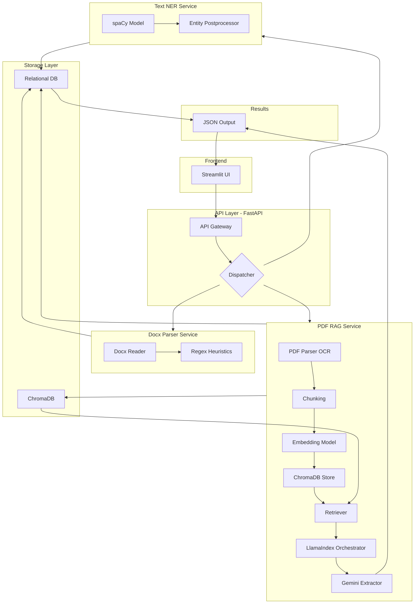

# Global Architecture Document (GAD)

**Project:** Financial Document Reader — NER Proof of Concept (PoC)

**Author:** Shashank Agasimani

**Date:** 2025-09-23

---

## 1. Purpose & Scope

This GAD describes a high-level architecture for a financial document reader that extracts structured entities from financial documents (DOCX, chat/plain text, PDF). The system is built as a PoC focused on **Named Entity Recognition (NER)** and demonstrates three processing flows:

* Rule-based parsing for DOCX
* spaCy-based NER for chat/text
* LLM + RAG pipeline (Google Gemini + ChromaDB + baai/bge-base-en-v1.5 embeddings + LlamaIndex) for PDFs

The document includes component interactions, data flow, example APIs, storage choices, security considerations, and an example output schema.

---

## 2. High-level architecture



> Diagram (Mermaid) visualizes how the Streamlit UI calls FastAPI. The API dispatches to specialized services and returns a JSON result to the UI.

---

## 3. Components & Responsibilities

### 3.1 Streamlit (Frontend)

* Purpose: simple web UI for uploading documents, pasting text, selecting processing mode (NER, Summary, Q\&A), and displaying results.
* Actions: POST file/text to FastAPI endpoints, poll for async job status (for large PDFs).

### 3.2 FastAPI (API Layer)

* Exposes endpoints for: `/upload`, `/ner`, `/status/{job_id}`, `/health`.
* Validates input and orchestration: routes requests to the appropriate pipeline (docx/text/pdf).
* For heavy/long-running jobs (PDF → LLM) it enqueues tasks and returns job id.

### 3.3 Docx Parser Service (Rule-based)

* Libraries: `python-docx`, regex, dateparser.
* Responsibility: reliably parse semi-structured term sheets and extract target entities using deterministic rules and heuristics.
* Output: JSON with entities + metadata (confidence = deterministic / high).

### 3.4 Text NER Service (spaCy)

* Libraries: `spaCy` (pretrained model), custom entity labels (COUNTERPARTY, NOTIONAL, ISIN, VALUATION\_DATE, MATURITY, UNDERLYING, COUPON, BARRIER, CALENDAR).
* Responsibility: run NER on chat-like or free text and return token-level and span-level extractions.
* Fine-tuning: methodology doc (GMD) describes how to fine-tune on labeled financial data.

### 3.5 PDF RAG Service (LLM + Vector DB)

* Libraries: LlamaIndex (framework), ChromaDB (vector store), embedding model `baai/bge-base-en-v1.5`, Google Gemini for generative extraction and reasoning.
* Responsibility: preprocess PDF (OCR if required), chunk text, create embeddings, store/retrieve vectors, and use RAG to ask the LLM targeted prompts for structured extraction.
* Output: JSON with extracted entities, provenance (source chunk ids), confidence/LLM reasoning trace.

### 3.6 Storage

* **ChromaDB**: persistent vector store for embeddings (PDF chunks + metadata).
* **Relational DB** (optional): persisted structured entity records for each processed document (Postgres/SQLite for PoC).
* **Object store / filesystem**: encrypted temporary storage for uploaded files.

---

## 4. Data Flow & Processing

### 4.1 Docx flow (sync)

1. Streamlit upload → `POST /ner` (type=docx)
2. FastAPI validates → calls Docx Parser Service
3. Parser reads docx, runs heuristics (header matching, key-value patterns, table parsing)
4. Parser returns JSON (entities + confidence)
5. FastAPI stores result in DB and returns JSON to UI

### 4.2 Chat/text flow (sync)

1. Streamlit paste/text → `POST /ner` (type=text)
2. FastAPI forwards to spaCy NER service
3. spaCy returns spans & labels → post-process to canonicalize dates/currencies
4. Store results and return JSON

### 4.3 PDF flow (async / RAG)

1. Streamlit upload → `POST /ner` (type=pdf)
2. FastAPI stores file, enqueues job (BackgroundWorker/Celery/Rq)
3. Worker: (a) OCR (if needed), (b) split into chunks, (c) compute embeddings (baai/bge), (d) upsert into ChromaDB
4. Run retrieval for candidate chunks and prompt Gemini via LlamaIndex to extract entities.
5. Return structured JSON and provenance for each entity; store in DB.

---

## 5. API Design (Example)

### `POST /ner` (sync)

Request body (multipart/form-data):

* `file` (optional) - uploaded file
* `text` (optional) - raw text
* `mode` - one of `docx` | `text` | `pdf`
* `entities` (optional) - list of desired entity names to extract

Response (200):

```json
{
  "job_id": null,
  "status": "done",
  "entities": { ... },
  "provenance": { ... }
}
```

### `POST /ner?async=true` (for PDF)

Response (202 Accepted):

```json
{ "job_id": "uuid-1234", "status": "queued" }
```

### `GET /status/{job_id}`

Returns job state and result when completed.

---

## 6. Entity Schema / Example Output

Canonical entity names and types (PoC):

* `Counterparty` (string)
* `Notional` (currency + numeric)
* `ISIN` (string)
* `Underlying` (string)
* `InitialValuationDate` (YYYY-MM-DD)
* `ValuationDate` (YYYY-MM-DD)
* `EffectiveDate` (YYYY-MM-DD)
* `TerminationDate` (YYYY-MM-DD)
* `Coupon` (percentage)
* `Barrier` (percentage)
* `Exchange` (string)
* `CalculationAgent` (string)
* `InterestPayments` (text/enum)

Example JSON (from Allianz trade):

```json
{
  "Counterparty": "BANK ABC",
  "PartyB": "CACIB",
  "TradeDate": "2025-01-31",
  "TradeTime": "09:12:15",
  "InitialValuationDate": "2025-01-31",
  "EffectiveDate": "2025-02-07",
  "Notional": "EUR 1,000,000",
  "UpfrontPayment": "TBD",
  "ValuationDate": "2026-07-31",
  "TerminationDate": "2026-08-07",
  "Underlying": "Allianz SE (ISIN DE0008404005)",
  "Exchange": "XETRA",
  "Coupon": "0%",
  "Barrier": "75%",
  "InterestPayments": "None",
  "CalculationAgent": "Party B and Party A",
  "ISDADocumentation": "Option"
}
```

---

## 7. Tech Stack & Libraries (PoC)

* Frontend: **Streamlit**
* API: **FastAPI** (uvicorn)
* Docx parsing: `python-docx`, `regex`, `dateparser`
* NER: **spaCy** (custom labels, optionally fine-tune)
* LLM & RAG: **Google Gemini** (LLM), **LlamaIndex** (framework), **ChromaDB** (vector DB), embeddings: `baai/bge-base-en-v1.5`
* Storage: SQLite/Postgres (PoC), filesystem for temp files
* Background jobs: Celery / RQ / FastAPI BackgroundTasks

---

## 8. Security, Privacy & Compliance

* **Encryption** at rest for stored documents and vectors (Chroma supports encrypted storage at deployment).
* **Access controls** on API endpoints (API keys / OAuth) — minimal for PoC, strongly recommended for production.
* **Data retention policy**: define TTL for temp files and vectors; allow manual purge.
* **PII redaction**: after extraction, consider redacting or flagging sensitive fields.

---

## 9. Scalability & Operational Notes

* Modular services: swap spaCy model or LLM without changing API.
* Vector DB scale: ChromaDB horizontally or use managed vector DBs (Pinecone, Milvus) for larger datasets.
* Monitoring: health endpoints, job metrics, model latency tracking.
* Cost: LLM usage (Gemini) will be the primary variable cost.

---

## 10. Testing & Evaluation

* Unit tests for rule-based parsing (edge-case term sheets).
* Integration tests: upload sample DOCX, text, and PDF; assert entity extraction matches ground truth.
* Model eval: measure precision/recall for entity spans; for LLM pipeline also measure provenance accuracy.

---

## 11. Next steps / Implementation plan (sprints)

1. **Sprint 1 (1 week)**: Implement FastAPI scaffold + Streamlit UI + docx rule-based parser.
2. **Sprint 2 (1 week)**: Add spaCy NER pipeline, simple fine-tune recipe and tests.
3. **Sprint 3 (2 weeks)**: Implement PDF preproc + embeddings + ChromaDB integration + LlamaIndex prompts to Gemini.
4. **Sprint 4 (1 week)**: Integration, persistence, security hardening, and final evaluation.

---

## 12. Appendix

* Example prompts for Gemini (RAG):

  * "Extract the following fields from the provided text: Counterparty, Notional, ISIN, InitialValuationDate, ValuationDate, TerminationDate, Underlying, Coupon, Barrier. Provide ISO dates and normalized numeric formats. For each field, show the source text and a confidence score."

* Example spaCy labels mapping and sample training data notes included in the GMD.
